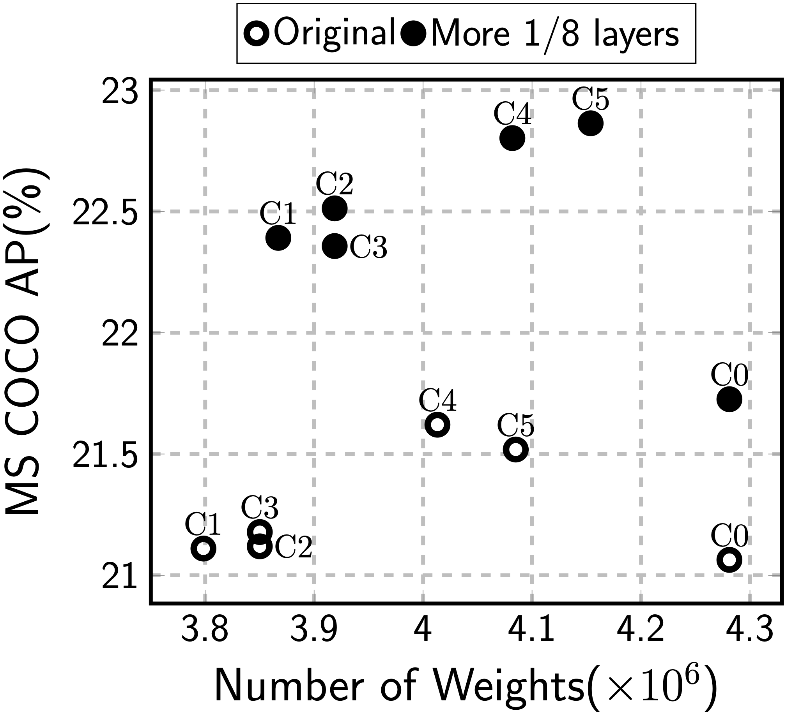
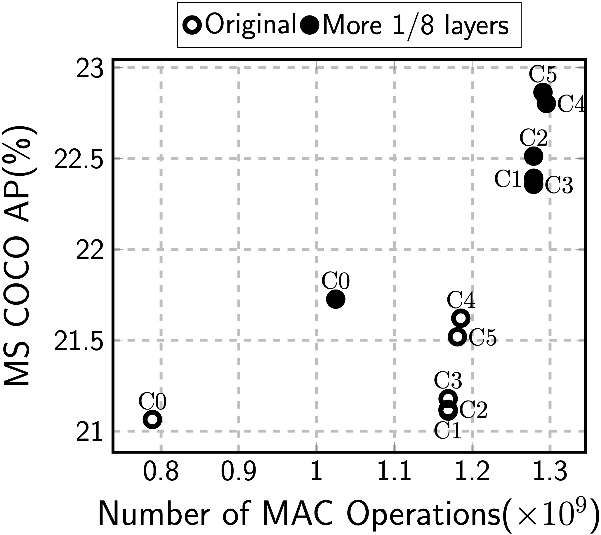

# SSDLiteX

## Introduction
SSDLite is an improved version of SSD and being widely used.
However, it is not well discussed which difference they have.
In SSDLiteX, the difference is discussed,
	and better model will be suggested.

## Citing SSDLiteX
Please cite SSDLiteX in your publications if it helps your research:

	@article{hjkang2023ssdlitex,
		author = {Kang, Hyeong-Ju},
		title = {Accelerator-Aware Pruning for Convolutional Neural Networks},
		journal = {IEEE Transactions on Circuits and Systems for Video Technology},
		volume = {30},
		number = {7},
		pages = {2093--2103},
		month = {July},
		year = {2020}
	}

## 1. Comparing SSD and SSDLite

### 1.1. Prior Box
SSD uses a box size of {0.1, 0.2, 0.37, 0.54, 0.71, 0.88} for VOC data set
and {0.07, 0.15, 0.33, 0.51, 0.69, 0.87} for MS COCO date set.
For aspect ratio, 
	SSD uses Type 1 for the first, fifth, sixth prior boxes 
		and Type 2 for the others.

SSDLite uses a box size of {0.2, 0.35, 0.5, 0.65, 0.8, 0.95} for MS COCO data set
	and aspect ratio of Type 3 for the first prior boxes
			and Type 2 for the others.

| Type		| (Size, Aspect Ratio) 				|
|----		|---								|
| Type 1	| (1,1) (sq 2,1) (1,2) (1,1/2)		|
| Type 2	| (1,1) (sq 2,1) (1,2) (1,1/2) (1,3) (1,1/3)	|
| Type 3	| (1/2,1) (1,2) (1,1/2)				|

### 1.2. Scale of Detection Layers
SSD uses the following scale feature maps for the box generation:
	1/8, 1/16, 1/32, 1/64, 1/128, and 1/256.
1/8 and 1/16 are extracted from the base CNN,
	and the others are from the auxiliary layers.
The final scale of the base CNN is modified from 1/32 to 1/16.
SSDLite uses 1/16, 1/32, 1/64, 1/128, 1/256, and 1/512 scale
	featuremaps for the box generation.
The scale of the base CNN is not modified.
And the output channel number of the last auxiliary layer
	is 256 in SSD and 128 in SSDLite.

### 1.3. Size Reduction
In SSD, if size reduction by 1/2 is equal to reduction by 2
	(ex. from 5x5 to 3x3), 
	3x3 convolution without padding is applied
		instead of strided convolution.
SSDLite always reduces the feature map size by strided convolution.

In some reserch, pooling is used instead of strided convoluiton.

### 1.4. Convolutional Layer for Fully-Connected Layer
SSD substitutes the fully connected layers in the base CNN
	with 3x3 convolutional layer (fc6) and 1x1 convolutional layer.
Furthermore, fc6 uses dilation of 6.
SSDLite does not use such layers.

### 1.5. Duplicated 1x1 Convolution
SSD auxiliary part consists of a few auxiliary stage,
	which has a 1x1 convolutional layer and a 3x3 convolutional layer.
SSDLite decomposes the 3x3 convolutional layer to 3x3 depthwise and 1x1 pointwise.
Therefore, an auxiliary stage consists of 1x1, 3x3 depthwise, and 1x1 convolution.
The number of channels is reduced by the first 1x1 and expaned by the last 1x1.
This constitution does not match the concepth of the MobileNet V2,
	whose basic block consists of expansion, depthwise, and projection.
It may be better to remove the first 1x1 convoluiton of channel reduction 
	in SSDLite.

### 1.6. More 1/8 Layers on MobileNetV2
MobileNetV2 has three bottleneck stages with 1/8 scale feature maps
	(1/4 scale to 1/8 scale at the first of the three stages)
	and seven bottleneck stage with 1/16 scale.
The last 1/8 scale feature maps, which will be used for box generation,
	may not have enough semantic information.
The scale down can be applied later
	so that seven stages with 1/8 scale and three stages with 1/16 scale.

## 2. Experimental Results

### 2.1. Configurations
We compared the MS COCO AP for the following configurations.

| Variations			| C0 | C1 | C2 | C3 | C4 | C5 |
|----					|--- |--- |--- |--- |--- |--- |
| Base: SSDLite			| O  | O  | O  | O  | O  | O  |
| SSD-like Prior Box	|    | O  | O  | O  | O  | O  |
| Scale 1/8				|    | O  | O  | O  | O  | O  |
| Reduction by no-pad	|    |    | O  | O  | O  | O  |
| 256 channels on last	|    |    | O  | O  | O  | O  |
| Pooling				|    |    |    | O  | O  | O  |
| fc6					|    |    |    |    | O  | O  |
| Less 1x1				|    |    |    |    |    | O  |

Variations
* SSD-like Prior Box: To use Type 1 and Type 2 like SSD
* Scale 1/8: Using 1/8 to 1/256 scale feature maps. The scale of the base CNN
		is not modified.
* Reduction by no-pad: To reducd the feature map size by no-padding convoluion
		if applicable.
* 256 channels on last: 256 channel output on the last auxiliary layer
* Pooling: To use max pooling instead of strided convolution
* fc6: fc6 between the base CNN layers and the auxiliary layers.
		fc7 is not used. fc6 is decomposed to depthwise and pointwise.
		Dilation is set to 1.
* Less 1x1: To use a 1x1 convolution per auxiliary stage

### 2.2. Results for MobileNetV2
The experiments are performed with two versions of MobileNetV2:
	the original one and the one with more 1/8 layers.

